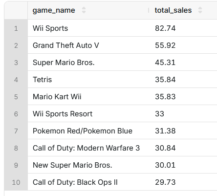
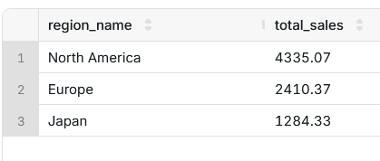
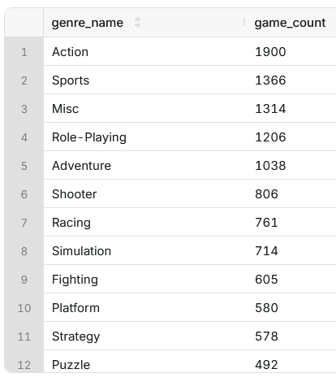

# Video Game Sales Analytics

## Company
**Pixel Insights Ltd.**  
Pixel Insights is a data analytics consultancy specializing in entertainment and media industries.  
Our team provides publishers, developers, and investors with data-driven insights to better understand market trends, player behavior, and the commercial performance of video games across regions, platforms, and genres.

---

## Project Overview
This project focuses on analyzing **global video game sales** using a PostgreSQL database.  
We explore which games, genres, platforms, publishers, and regions drive the most sales, and how these patterns evolve over time.  
The analysis is performed through SQL queries and Python scripts that extract and summarize key performance metrics.

### Example Analytics
- Top 10 best-selling games worldwide  

- Top regions by sales  

- Top genres by game count  



## How to Run the Project

### 1. Clone the Repository
```bash
git clone https://github.com/yourusername/videogame-analytics.git
cd videogame-analytics
```

### 2. Set Up PostgreSQL Database
- Install PostgreSQL (if not already installed).
- Create a database called `videogames`.
- Import the dataset into the schema `video_games`.

### 3. Configure Database Connection
Update `DB_CONFIG` in `main.py` with your PostgreSQL credentials:
```python
DB_CONFIG = {
    "host": "localhost",
    "port": 5432,
    "dbname": "videogames",
    "user": "postgres",
    "password": "yourpassword"
}
```

### 4. Install Python Dependencies
```bash
pip install psycopg2
```

### 5. Run Analytics
```bash
python main.py
```
This will execute all predefined SQL queries and print results in the terminal.

---

## Sample SQL Queries
Below are example SQL queries used in the project to analyze the video game sales dataset:

### Top 10 Best-Selling Games Worldwide
```sql
SELECT g.game_name, SUM(s.sales) as total_sales
FROM video_games.games g
JOIN video_games.sales s ON g.game_id = s.game_id
GROUP BY g.game_name
ORDER BY total_sales DESC
LIMIT 10;
```

### Best-Selling Publishers
```sql
SELECT p.publisher_name, SUM(s.sales) as total_sales
FROM video_games.publishers p
JOIN video_games.games g ON p.publisher_id = g.publisher_id
JOIN video_games.sales s ON g.game_id = s.game_id
GROUP BY p.publisher_name
ORDER BY total_sales DESC
LIMIT 5;
```

### Genre Performance by Region
```sql
SELECT r.region_name, g.genre_name, SUM(s.sales) as total_sales
FROM video_games.regions r
JOIN video_games.sales s ON r.region_id = s.region_id
JOIN video_games.games g ON s.game_id = g.game_id
GROUP BY r.region_name, g.genre_name
ORDER BY r.region_name, total_sales DESC;
```

### Yearly Sales Trends
```sql
SELECT EXTRACT(YEAR FROM s.sale_date) as sale_year, SUM(s.sales) as total_sales
FROM video_games.sales s
GROUP BY sale_year
ORDER BY sale_year;
```

---

## Tools & Resources
- **PostgreSQL**: Relational database to store and query video game sales data.
- **Python (psycopg2)**: To connect to PostgreSQL and run SQL queries programmatically.
- **SQL**: For data extraction, aggregation, and analytics.
- **Git/GitHub**: For version control and collaboration.
- **Data Source**: Video Game Sales dataset (structured into tables: games, genres, publishers, platforms, regions, and sales).

---

## Next Steps
- Add visualizations (e.g., matplotlib, seaborn, or Tableau dashboards).
- Deploy results on a simple web interface for interactive exploration.
- Expand analysis with predictive models for future sales forecasting.